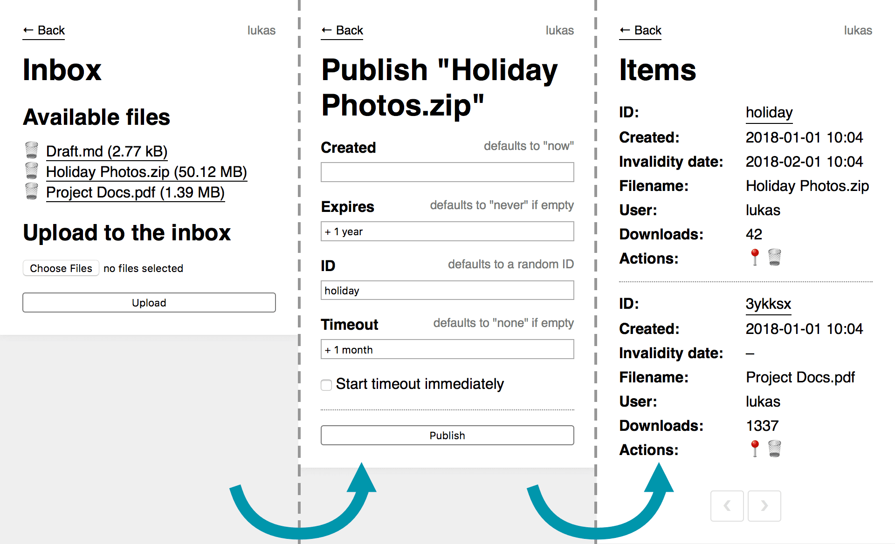

# Shareable

[](https://travis-ci.com/lukasbestle/shareable) [](https://coveralls.io/github/lukasbestle/shareable?branch=master)

> Simple NoDB file upload app

## Screenshots



## Features

- Completely file-based and very fast
- Simple admin interface to upload, publish and manage files with support for user permissions
- Support for uploads using SFTP/SCP or other protocols into an inbox directory on the server
- Support for automatic randomized URLs as well as completely custom URLs
- Support for time-based publishing and expiry
- Support for auto-expiry based on download inactivity
- Automatic cleanup of expired files using a Cronjob script
- Compatible with pull zone CDNs

## Installation

1. Download the [latest release ZIP](https://github.com/lukasbestle/shareable/releases) (includes all dependencies).  
   Alternatively you can clone the Git repository and install the dependencies with `composer install --no-dev`.
2. Upload the project to your webserver.
3. Shareable uses two webroots:
   - Point the webserver for your main domain at the `public` directory.
   - Point the webserver for your file domain/CDN at the `data/files` directory.
4. Copy the file `config/config.example.php` to `config/config.php` and adapt it to your needs.

Shareable requires PHP 7.1+.

## Usage

The admin interface of Shareable can be reached at the URL `https://example.com/_admin`. It will prompt for user credentials using HTTP Basic authentication.

### File upload

You can upload files directly in the admin interface on the **Inbox** screen. All uploaded files are stored in the `data/inbox` directory. Therefore it is also possible to place files into this directory manually (e.g. with SFTP or SCP).

### Publishing files

The next step is to publish the previously uploaded files. You can do this by clicking on the file in the **Inbox list**.  
You will be prompted for the following options:

- **Created**  
  The time when the file should be published. The file won't be accessible before that time. This is useful if you want to upload files in advance and schedule their release.  
  If you leave this field empty, the file will immediately be public.
- **Expires**  
  The time when the file should expire. After that time the file won't be accessible.  
  If you remove the default value and leave the field empty, the file will never expire.  
  If given as a relative value (e.g. `+ 1 year`), the relative date is calculated from the "Created" date.
- **ID**  
  The slug in the shareable file URL.  
  By default it will be randomly generated as a six-char alphanumerical string. The random ID includes the current date in an encoded form, so the random ID will never be the same as one generated in the past.   
  If you want a custom ID for sharing, you can configure it here.
- **Timeout**  
  An inactivity timeout. If the file hasn't been downloaded for this amount of time, the file is considered expired.  
  If you remove the default value and leave the field empty, no timeout is set.
- **Start timeout immediately**  
  If checked, the timeout will be active from the "Created" date on. Otherwise it will be active after the first download. This allows two different use-cases:
  - **Immediate start**: You want to share a file with a group of people and automatically want to delete it once no one downloads it anymore. Particularly useful together with a fixed expiry time (e.g. "expire in one year, but quicker if no one downloaded the file for a month").
  - **Start with the first download**: You want to share a file with one person only and want to delete the file after they have downloaded it (e.g. "delete the file two days after the last download"). By not starting the timeout immediately, you give the recipient time to download the file for the first time (which will then start the timeout timer). Please note however that a request is sometimes triggered by apps without the recipient actively clicking on a link (e.g. by messenger apps when generating a URL preview). This feature unfortunately won't work for those use-cases.

Shareable will by default create a subdirectory for each published file inside the `data/files` directory. This makes direct file URLs harder to guess and also ensures that the original filenames of the uploaded files can be kept without having to append a suffix to the filename. You can disable this feature in the config if you prefer to keep all files in the top-level.

### Sharing files

You can now access your uploaded files at `https://example/<id>`.  
If you want to share the URL, you can copy it from the link in the **Items** table in the ID column.

### Deleting expired files

Shareable doesn't delete expired files by default, but expired files are no longer accessible via their URL.

However it makes sense to clean up expired files by deleting the file and its metadata. For that, Shareable ships with the script in `bin/cleanup`. The script deletes all files that are expired based on their expiry date or timeout. It also outputs warnings if files and metadata are out of sync.

It is recommended to call this script daily from a Cronjob:

```
@daily /path/to/your/bin/cleanup
```

If you prefer, you can also call the script manually instead.

### Using Shareable with a CDN

The published files are stored in the `data/files` directory. You can directly point a subdomain at this directory and let your webserver serve the static files.

It is also possible to use a pull zone CDN:

1. Point your local webserver at the `data/files` directory. You can use any subdomain for this.
2. Set up a pull zone at your CDN provider by pointing the CDN to the file subdomain you set up in step 1.
3. Set the `fileUrl` option in Shareable's config to the URL of the CDN.

Shareable will now redirect file requests to the CDN instead of to your local file subdomain.

## License

<http://www.opensource.org/licenses/mit-license.php>

## Author

Lukas Bestle <project-shareable@lukasbestle.com>